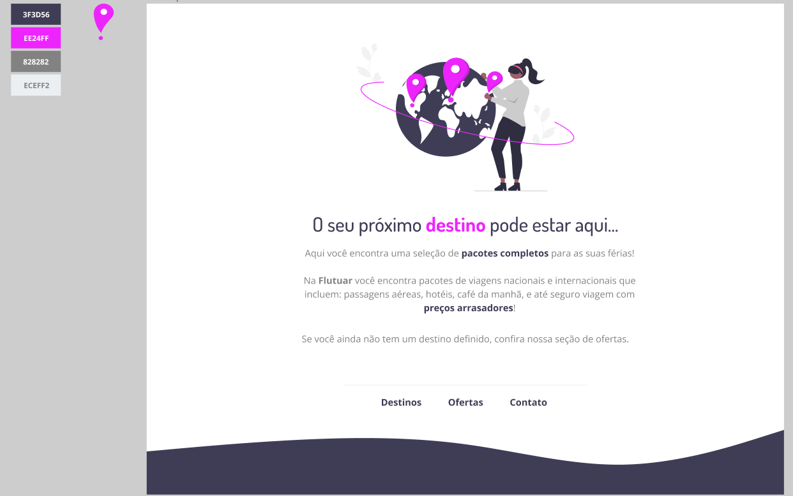

# Challenge made during the Explorer course by Rocketseat
 
 Project made during the Explorer program in Rocketseat, using HTML and CSS.

 ### Figma project
 

 ### Landing page
 Here is the landing page, available using Vercel: [Landing Page](https://explorer-projeto-01-extra.vercel.app/).

 ### Comentary

 Using a template in Figma, we learned how to build a landing page. It was an exercise and an oportunity to review some HTML and CSS and challenge myself.

 ### Feedbacks

 Please, feel free to reach at anytime with feedbacks and ideas to help me get better. 

 My social medias:
 * X (Twitter): [@_michellemello](https://twitter.com/_michellemello)
 * LinkedIn: [Michelle Mello](https://www.linkedin.com/in/michelle-mello/)
 * Dev.to: [_michellemello](https://dev.to/_michellemello)

